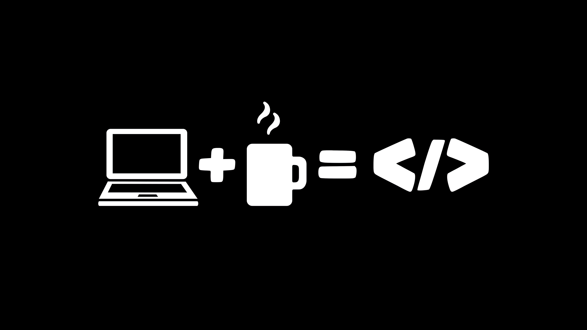

<html lang="en">
<head>
    <meta charset="UTF-8">
    <meta name="viewport" content="width=device-width, initial-scale=1.0">
    <title>KAVANA GS | Portfolio</title>
    <link rel="stylesheet" href="https://cdnjs.cloudflare.com/ajax/libs/font-awesome/6.4.0/css/all.min.css">
    
</head>
<body>
    <!-- Header -->
    <header id="header">
        

            <nav class="navbar">
                <a href="#" class="logo">KAVANA GS</a>
                <ul class="nav-links">
                    <li><a href="#about">About</a></li>
                    <li><a href="#projects">Projects</a></li>
                    <li><a href="#skills">Skills</a></li>
                    <li><a href="#certificates">Certificates</a></li>
                    <li><a href="#contact">Contact</a></li>
                </ul>
                

                    <i class="fas fa-bars"></i>
                

            </nav>
        

    </header>

    <!-- Hero Section -->
    <section class="hero" id="home">
        

            

                

                    <h1>Hello, I'm KAVANA GS</h1>
                    
Engineering Student passionate about Web Development, Machine Learning, and creating innovative solutions to real-world problems.

                    

                        <a href="#projects" class="btn">View My Work</a>
                        <a href="#contact" class="btn btn-secondary">Get In Touch</a>
                    

                

                

                    
                

            

            <a href="#about" class="scroll-down">
                <i class="fas fa-chevron-down"></i>
                Scroll Down
            </a>
        

    </section>

    <!-- About Section -->
    <section class="about" id="about">
        

            

                <h2>About Me</h2>
            

            

                

                    <h3>Engineering Student & Aspiring Developer</h3>
                    
I'm currently pursuing my Engineering at Global Academy of Technology, with interest in technology, problem-solving, and continuous learning.

                    
 I enjoy building web applications. I have builded small web apps, data projects and enjoy to learn new technologies.

                    
                    <!-- Social Links Added Here -->
                    

                        <a href="https://www.linkedin.com/in/kavana-g-s-12b91b391" class="social-link" target="_blank">
                            <i class="fab fa-linkedin"></i>
                            LinkedIn
                        </a>
                        <a href="https://github.com/" class="social-link" target="_blank">
                            <i class="fab fa-github"></i>
                            GitHub
                        </a>
                        <a href="mailto:kavanags83@gmail.com" class="social-link">
                            <i class="fas fa-envelope"></i>
                            Email
                        </a>
                    

                    
                    

                        <h3>Education</h3>
                        

                            <h4>Global Academy Of Technology</h4>
                            
2024 – 2027

                            
Engineering

                        

                        

                            <h4>Raman Polytechnic</h4>
                            
2024

                            
84.90% — 9.00 CGPA

                        

                        

                            <h4>R.V.S High School</h4>
                            
2021

                            
59.36%

                        

                    

                

                

                 
                

            

        

    </section>

    <!-- Projects Section - Replace with your JPEG files -->
<section class="projects" id="projects">
    

        

            <h2>My Projects</h2>
        

        

            <!-- Project 1 - Food Delivery Prediction -->
            

                

                

                    <h3>Food Delivery Prediction</h3>
                    
Predicting demand and delivery times using data analysis and ML models to optimize food delivery services.

                    

                        Python
                        scikit-learn
                        Pandas
                        Data Analysis
                    

                

            

            <!-- Project 2 - Reminder Web App -->
            

                

                

                    <h3>Reminder Web App</h3>
                    
Lightweight reminder application with notifications built using HTML, CSS, and JavaScript.

                    

                        HTML
                        CSS
                        JavaScript
                        Web App
                    

                

            

            <!-- Project 3 - Customer Segmentation -->
            

                

                

                    <h3>Customer Segmentation</h3>
                    
Unsupervised clustering to group customer segments for targeted marketing strategies.

                    

                        Python
                        scikit-learn
                        Clustering
                        Data Science
                    

                

            

        

    

</section>

    <!-- Skills Section -->
    <section class="skills" id="skills">
        

            

                <h2>Skills & Tools</h2>
            

            

                

                    <h3><i class="fas fa-code"></i> Programming Languages</h3>
                    

                        Python
                        Java
                        C
                        HTML
                        CSS
                        JavaScript
                    

                

                

                    <h3><i class="fas fa-tools"></i> Tools & Technologies</h3>
                    

                        VS Code
                        Jupyter
                        MySQL
                        Git
                        Eclipse
                        Code Blocks
                    

                

                

                    <h3><i class="fas fa-brain"></i> Data Science & ML</h3>
                    

                        Pandas
                        NumPy
                        scikit-learn
                        Data Analysis
                        Machine Learning
                    

                

            

        

    </section>

   <!-- Certificates Section -->
<section class="certificates" id="certificates">
    

        

            <h2>Certifications</h2>
        

        

            

                <i class="fas fa-database"></i>
                <h3>Big Data</h3>
                
Comprehensive understanding of big data concepts and technologies.

                <button class="btn btn-secondary" onclick="openPDF('Big Data Certificate', 'Big Data.pdf')">View Certificate</button>
            

            

                <i class="fas fa-brain"></i>
                <h3>Machine Learning</h3>
                
Fundamentals of machine learning algorithms and applications.

                <button class="btn btn-secondary" onclick="openPDF('Machine Learning Certificate', 'ML.pdf')">View Certificate</button>
            

            

                <i class="fab fa-python"></i>
                <h3>Python Programming</h3>
                
Advanced Python programming skills and best practices.

                <button class="btn btn-secondary" onclick="openPDF('Python Certificate', 'Python.pdf')">View Certificate</button>
            

            

                <i class="fas fa-code"></i>
                <h3>Web Technology</h3>
                
Modern web development technologies and frameworks.

                <button class="btn btn-secondary" onclick="openPDF('Web Technology Certificate', 'web-technology.pdf')">View Certificate</button>
            

            

                <i class="fas fa-robot"></i>
                <h3>Artificial Intelligence</h3>
                
IBM certified AI professional with practical implementation skills.

                <button class="btn btn-secondary" onclick="openPDF('AI Certificate', 'IBM-Artificial-Intelligence_Badge.pdf')">View Certificate</button>
            

            

                <i class="fas fa-robot"></i>
                <h3>Computer Network</h3>
                
Strong understanding of network protocols, configuration, and troubleshooting techniques.

                <button class="btn btn-secondary" onclick="openPDF('Computer Network Certificate', 'computer-network-certificate.pdf')">View Certificate</button>
            

        

    

</section>

<!-- PDF Modal -->

    

        

            <h3 id="pdfTitle">Certificate</h3>
            <button class="close-modal" id="closeModal">
                <i class="fas fa-times"></i>
            </button>
        

        <iframe class="pdf-viewer" id="pdfViewer" src=""></iframe>
    

    <!-- Contact Section -->
    <section class="contact" id="contact">
        

            

                <h2>Contact Me</h2>
            

            

                

                    

                        

                            <i class="fas fa-envelope"></i>
                        

                        

                            <h4>Email</h4>
                            
kavanags83@gmail.com

                        

                    

                    

                        

                            <i class="fas fa-map-marker-alt"></i>
                        

                        

                            <h4>Location</h4>
                            
Bengaluru, Karnataka, India

                        

                    

                    <!--
                    

                        

                            <i class="fas fa-phone"></i>
                        

                        

                            <h4>Phone</h4>
                            
+91 XXXXX XXXXX

                        

                    

                    -->
                    

                        

                            <i class="fas fa-graduation-cap"></i>
                        

                        

                            <h4>Education</h4>
                            
Global Academy of Technology

                        

                    

                

                

                    <form id="contactForm">
                        

                            <label for="name">Your Name</label>
                            <input type="text" id="name" class="form-control" placeholder="Enter your name" required>
                        

                        

                            <label for="email">Your Email</label>
                            <input type="email" id="email" class="form-control" placeholder="Enter your email" required>
                        

                        

                            <label for="subject">Subject</label>
                            <input type="text" id="subject" class="form-control" placeholder="Enter subject" required>
                        

                        

                            <label for="message">Your Message</label>
                            <textarea id="message" class="form-control" placeholder="Enter your message" required></textarea>
                        

                        <button type="submit" class="btn">Send Message</button>
                    </form>
                

            

        

    </section>

    <!-- Footer -->
    <footer>
        

            

                
KAVANA GS

                

                    <a href="https://www.linkedin.com/in/kavana-g-s-12b91b391" class="footer-social-link">
                        <i class="fab fa-linkedin"></i>
                    </a>
                    <a href="https://github.com/" class="footer-social-link">
                        <i class="fab fa-github"></i>
                    </a>
                    <a href="mailto:kavanags83@gmail.com" class="footer-social-link">
                        <i class="fas fa-envelope"></i>
                    </a>
                

            

        

    </footer>

    
</body>
</html>
